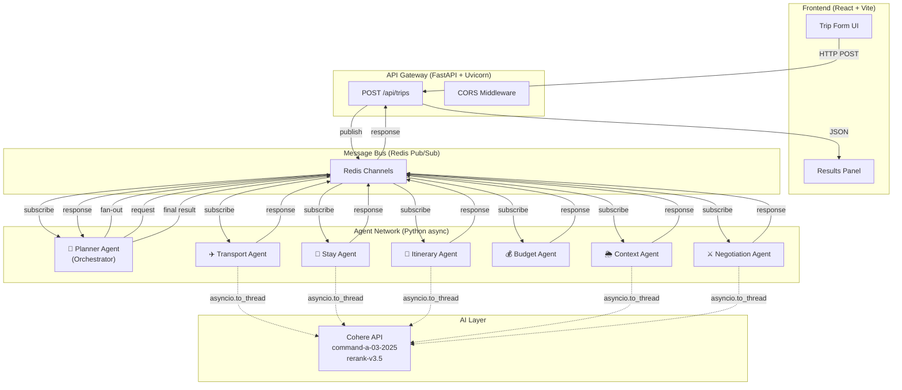
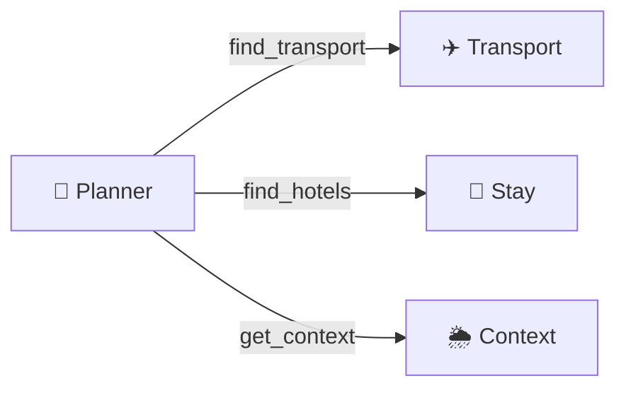
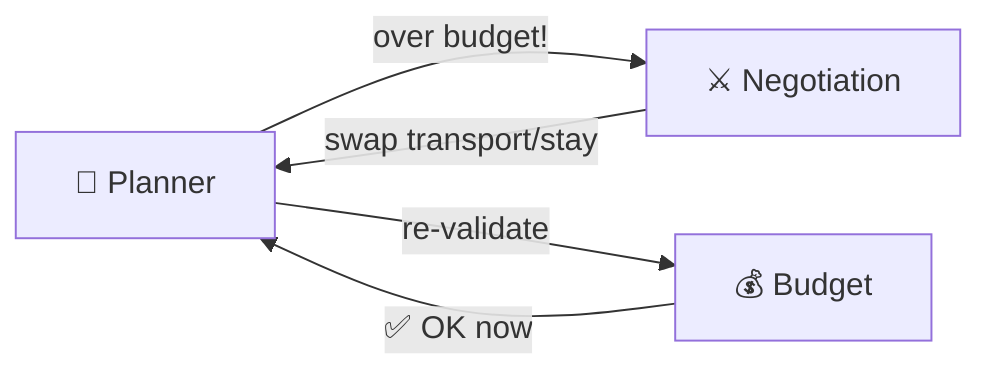

# 🌍 Agentic Travel Planner — Full System Flow

## Architecture Overview



---

## Step-by-Step Flow

### Step 1 — User Submits the Form
| Tech | `React 19` · `Vite 8` · `fetch API` |
|------|------|

The user fills in the form at `http://localhost:5173` and clicks **"🚀 Plan My Trip"**.

```
Form Data → { destination: "Goa", budget: 20000, duration: 5, preferences: ["food", "nightlife"], origin: "Delhi" }
```

React sends an HTTP `POST` to the FastAPI backend:
```js
fetch('http://localhost:8000/api/trips', { method: 'POST', body: JSON.stringify(formData) })
```
The UI switches to a loading state showing all 7 agent chips pulsing.

---

### Step 2 — FastAPI Gateway Receives the Request
| Tech | `FastAPI` · `Uvicorn` · `Pydantic` |
|------|------|

[trips.py](file:///c:/Users/tewar/Desktop/Travel_Planner_Agent/api/routes/trips.py) validates the request body using `TripCreateRequest` (Pydantic model), generates a `trip_id` (UUID), and constructs an `AgentMessage`:

```python
AgentMessage(
    from_agent = GATEWAY,
    to_agent   = PLANNER,
    task       = "plan_trip",
    payload    = { destination, budget, duration, preferences, origin },
    correlation_id = trip_id
)
```

The gateway then calls `bus.request_response("planner-agent", message, timeout=120)` which:
1. Creates a **unique** Redis response channel: `response:{trip_id}:{uuid8}`
2. Subscribes to that channel
3. Publishes the message to the `planner-agent` channel
4. `await`s the response (up to 120 seconds)

---

### Step 3 — Redis Pub/Sub Delivers the Message
| Tech | `Redis 7 (Alpine)` · `redis.asyncio` |
|------|------|

The [redis_bus.py](file:///c:/Users/tewar/Desktop/Travel_Planner_Agent/shared/message_bus/redis_bus.py) background listener loop ([_listen()](file:///c:/Users/tewar/Desktop/Travel_Planner_Agent/shared/message_bus/redis_bus.py#75-108)) runs continuously, pulling messages from Redis pub/sub. When it sees a message on the `planner-agent` channel, it dispatches the handler via `asyncio.create_task()` — ensuring the listener loop stays free for other messages.

> **Key Design:** Handlers are dispatched as background tasks, NOT awaited inline. This prevents the deadlock where the Planner would block the listener while waiting for sub-agent responses.

---

### Step 4 — Planner Agent Orchestrates (Fan-Out)
| Tech | `BaseAgent` SDK · `asyncio.gather` · `Redis Pub/Sub` |
|------|------|

The [planner_agent.py](file:///c:/Users/tewar/Desktop/Travel_Planner_Agent/agents/planner/planner_agent.py) receives the message and kicks off **3 parallel requests** using `asyncio.gather`:



Each `self.request()` call creates its own unique response channel (via [request_response](file:///c:/Users/tewar/Desktop/Travel_Planner_Agent/shared/message_bus/redis_bus.py#109-143)), publishes to the target agent's channel, and waits for the response.

---

### Step 5a — Transport Agent Finds & Ranks Options
| Tech | `JSON mock data` · `Cohere rerank-v3.5` · `asyncio.to_thread` |
|------|------|

[transport_agent.py](file:///c:/Users/tewar/Desktop/Travel_Planner_Agent/agents/transport/transport_agent.py):
1. Loads mock transport data from [transport.json](file:///c:/Users/tewar/Desktop/Travel_Planner_Agent/agents/transport/data/transport.json) (flights, trains, buses for Goa/Manali/Jaipur/Kerala)
2. Filters options within budget
3. **Calls Cohere `rerank-v3.5`** to rank options by relevance to user preferences (e.g. "luxury" → flights ranked higher, "budget" → trains ranked higher)
4. Returns sorted options + recommended pick

> **Thread offloading:** The Cohere SDK is synchronous. Calls are wrapped in `asyncio.to_thread()` to prevent blocking the event loop.

### Step 5b — Stay Agent Finds & Ranks Accommodation
| Tech | `JSON mock data` · `Cohere rerank-v3.5` · `asyncio.to_thread` |
|------|------|

[stay_agent.py](file:///c:/Users/tewar/Desktop/Travel_Planner_Agent/agents/stay/stay_agent.py):
1. Loads mock stay data from [stays.json](file:///c:/Users/tewar/Desktop/Travel_Planner_Agent/agents/stay/data/stays.json)
2. Calculates `total_price = price_per_night × duration`
3. **Calls Cohere `rerank-v3.5`** to rank by preference match
4. Returns all options + recommended + cheapest

### Step 5c — Context Agent Gathers Intelligence
| Tech | `JSON mock data` · `Cohere command-a-03-2025` · `asyncio.to_thread` |
|------|------|

[context_agent.py](file:///c:/Users/tewar/Desktop/Travel_Planner_Agent/agents/context/context_agent.py):
1. Loads weather, events, crowd data from [context.json](file:///c:/Users/tewar/Desktop/Travel_Planner_Agent/agents/context/data/context.json)
2. **Calls Cohere LLM** to generate personalized travel tips based on destination + preferences
3. Returns weather, events, crowd level, and AI-enhanced tips

---

### Step 6 — Planner Receives All Parallel Results
| Tech | `asyncio.gather` |
|------|------|

`asyncio.gather(transport_task, stay_task, context_task)` resolves once all 3 agents have responded via their unique response channels. The Planner now has:
- Transport options + recommended pick
- Stay options + recommended pick  
- Weather, events, tips

---

### Step 7 — Itinerary Agent Builds Day-wise Plan
| Tech | `JSON mock data` · `Cohere command-a-03-2025` · `asyncio.to_thread` |
|------|------|

The Planner sends the gathered context to [itinerary_agent.py](file:///c:/Users/tewar/Desktop/Travel_Planner_Agent/agents/itinerary/itinerary_agent.py):
1. Loads activities from [activities.json](file:///c:/Users/tewar/Desktop/Travel_Planner_Agent/agents/itinerary/data/activities.json)
2. Prioritizes activities matching user preferences
3. Assigns time slots (morning/afternoon/evening) and meal breaks
4. Calculates per-day and total activity costs
5. **Calls Cohere LLM** to generate creative, personalized daily suggestions

Returns: array of `{ day, activities, meals, day_cost }` + LLM suggestions string.

---

### Step 8 — Budget Agent Validates Costs
| Tech | `Python arithmetic` · `Pydantic` |
|------|------|

The Planner sends cost data to [budget_agent.py](file:///c:/Users/tewar/Desktop/Travel_Planner_Agent/agents/budget/budget_agent.py):

```
transport_cost = recommended_transport.price × 2 (round trip)
stay_cost      = recommended_stay.total_price
activities_cost = sum of itinerary costs
food_estimate  = duration × ₹600/day
miscellaneous  = max(budget × 5%, duration × ₹500)
```

Returns: full breakdown, `within_budget` boolean, `overshoot` amount, and cost-cutting `suggestions`.

---

### Step 9 — Negotiation Agent (Conditional)
| Tech | `Sorting algorithms` · `Cohere command-a-03-2025` · `asyncio.to_thread` |
|------|------|

**Only triggered if `needs_negotiation = true`** (budget exceeded).

[negotiation_agent.py](file:///c:/Users/tewar/Desktop/Travel_Planner_Agent/agents/negotiation/negotiation_agent.py) applies 3 strategies:
1. **Strategy 1:** Find cheaper transport (sort by price/rating ratio)
2. **Strategy 2:** Find cheaper stay (best-rated among cheaper options)
3. **Strategy 3:** **Call Cohere LLM** for creative cost-saving tips if still over budget

Returns: `new_transport`, `new_stay`, `changes` array, `total_saved`.

If negotiation was applied, the Planner **re-validates** with the Budget Agent using the new costs.



---

### Step 10 — Planner Assembles Final Response
| Tech | `Cohere command-a-03-2025` · `asyncio.to_thread` · `dict assembly` |
|------|------|

The Planner:
1. **Calls Cohere LLM** one final time to generate a 2-3 sentence exciting trip summary
2. Assembles the complete response dict:

```python
{
    "trip_id", "destination", "duration", "summary",
    "transport": { "options": [...], "selected": {...} },
    "stay": { "options": [...], "selected": {...} },
    "itinerary": [{ "day": 1, "activities": [...], "meals": [...], "day_cost": ... }],
    "cost_breakdown": { "transport", "accommodation", "activities", "food", "misc", "total", "within_budget", "savings" },
    "context": { "weather", "events", "crowd_level", "tips" },
    "negotiation_applied": bool,
    "negotiation_changes": [...],
    "llm_itinerary_suggestions": "..."
}
```

3. Publishes the response to the Gateway's unique response channel via `reply_to`

---

### Step 11 — Gateway Returns HTTP Response
| Tech | `FastAPI` · `JSON serialization` |
|------|------|

The `await bus.request_response(...)` in [trips.py](file:///c:/Users/tewar/Desktop/Travel_Planner_Agent/api/routes/trips.py) resolves. The route wraps the result:

```json
{ "trip_id": "...", "status": "completed", "elapsed_ms": 12450, "result": { ... } }
```

The response is sent back over HTTP with CORS headers (`Access-Control-Allow-Origin: *`).

---

### Step 12 — React UI Renders the Results
| Tech | `React 19` · `CSS animations` · `Conditional rendering` |
|------|------|

The frontend receives the JSON and calls `setResult(data.result)`. React re-renders the results panel with animated sections:

| Section | What It Shows |
|---------|--------------|
| **Trip Summary** | AI-generated summary, duration, budget, elapsed time |
| **Negotiation Banner** | If budget was exceeded, shows what was swapped |
| **✈️ Transport Options** | Cards with provider, price, rating, "Selected" badge |
| **🏨 Accommodation** | Cards with hotel name, price/night, amenities |
| **📍 Itinerary Timeline** | Expandable day cards with time-slotted activities |
| **💰 Cost Breakdown** | Line items + total + budget status (under/over) |
| **🌦️ Travel Context** | Weather, crowd level, events, AI tips |
| **📊 Agent Logs** | Decision trace from all 7 agents |

---

## Complete Tech Stack Summary

| Layer | Technology | Purpose |
|-------|-----------|---------|
| **Frontend** | React 19 + Vite 8 | SPA with premium dark UI |
| **Styling** | Vanilla CSS | Glassmorphism, gradients, animations |
| **HTTP Client** | Fetch API | Browser → Backend communication |
| **API Gateway** | FastAPI + Uvicorn | Async HTTP server, request validation |
| **Validation** | Pydantic v2 | Request/response schema validation |
| **Message Bus** | Redis 7 (Pub/Sub) | Async agent-to-agent communication |
| **Redis Client** | redis.asyncio | Non-blocking Redis operations |
| **Agent SDK** | Custom `BaseAgent` | Retry logic, structured logging, request-response pattern |
| **LLM Generation** | Cohere `command-a-03-2025` | Trip summaries, itinerary suggestions, travel tips |
| **LLM Ranking** | Cohere `rerank-v3.5` | Preference-based transport/stay ranking |
| **Thread Safety** | `asyncio.to_thread` | Offloads blocking Cohere SDK calls |
| **Concurrency** | `asyncio.create_task` + `asyncio.gather` | Parallel agent fan-out, non-blocking listener |
| **Database** | PostgreSQL 16 (Docker) | Persistent storage (schema ready, not yet wired) |
| **ORM** | SQLAlchemy 2.0 (async) | Database models for User, Trip, AgentLog |
| **Containers** | Docker Compose | Redis + PostgreSQL infrastructure |
| **Logging** | Custom `AgentLogger` | Structured decision tracing with correlation IDs |
